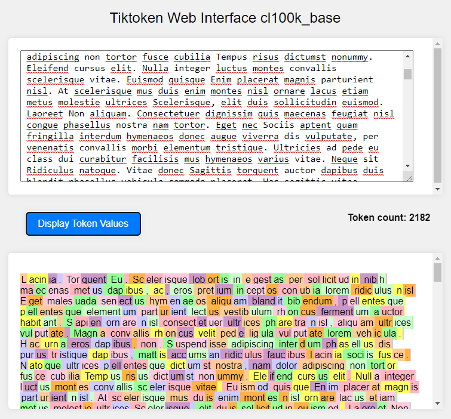

# TikToken-Web

A simple web application to demonstrate the tokenization capabilities using `tiktoken`.

## Features
- Tokenize text using a simple web interface.
- Built with Flask and supports CORS.
- Payload limit of ~10MB for tokenization.

## Setup and Run
1. Ensure you have Flask and `tiktoken` installed. If not, install them using pip:

```bash
pip install Flask tiktoken
```

2. Run the server using:

```bash
python server.py
```

3. Access the web interface by navigating to `http://localhost:5000` in your browser.

## Endpoints
- `/tokenize`: Accepts POST requests to tokenize text. Returns the tokenized text as a response.

## Screenshots


## License
This project is open-source and available under the MIT License.

## Contributing
Feel free to fork, raise issues, and submit Pull Requests.

---

Made with ❤️ by [Foxabilo]
